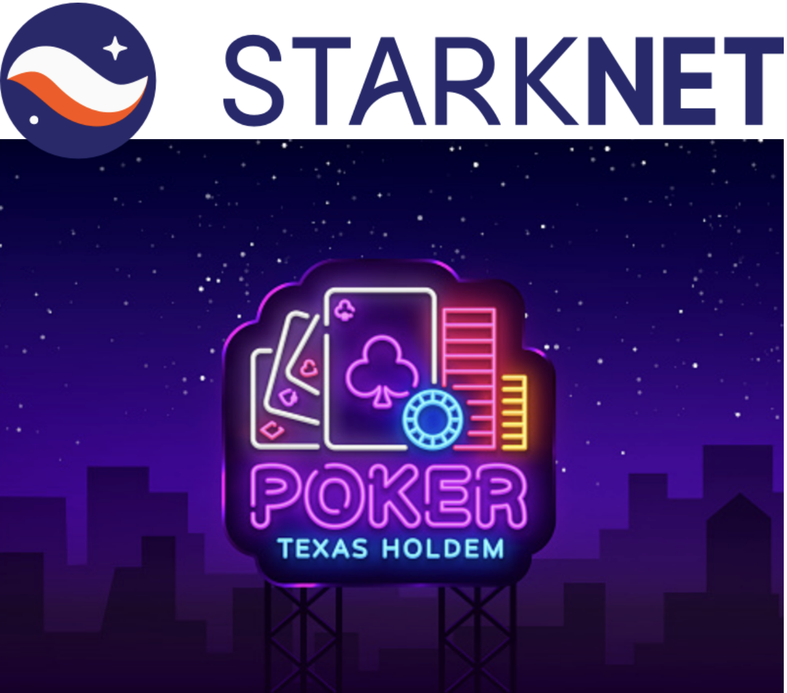

<p align="center">
  
</p>


<details>
<summary>Table of Contents</summary>

- [About](#about)
- [Roadmap](#roadmap)
- [Warning](#warning)

- [Prerequisites](#prerequisites)
  - [Build](#build)
- [Roadmap](#roadmap)
- [Authors \& contributors](#authors--contributors)
- [License](#license)

</details>

## About

>**Kaiji** is an implementation of the popular texas holdem poker, using starknet ZK proof to make a fully trustless poker game ! While the card information is fully private, each player’s actions for every game is recorded on-chain for auditability and fairness. In online Poker history, lot of scam, rigged games and other frauds have been reported, and this is why we decided to make a fully trustless poker game, where you can play without any fear of being scammed !

## Roadmap

This is an hackaton project, we will continue to work on it to make it a fully trustless poker game. **Basically, for the moment,
we have a working poker game, but the ZK proof have to be optimized because at this state, the game is not at 100% trustless / some actions, like generating random numbers are unfortunately not developped in Cairo !**

This Project introduce us into the world of the ZK randomness, which is a very interesting topic that we want to work on using SNARK Randao and VDF, a great challenge for the future !

**The game will evolve in this way : **

-- Playing without any dealer function (because you cant trust him), but instead :
  - Each Player will, thanks to Cairo randomness function, generate a random number, and then, shuffle the deck, encrypt it and send it to the next player that will do the same and so on.
  - Each player takes out 2 cards as their hole cards. They then decrypt the hole cards of all other players, so that each player can only see their own hole cards and not those of others.
  - For the public cards such as flop, turn and river, everyone decrypt them at the same time, so that everyone can see the public cards at the same time.
  - Showdown : Each player will decrypt their hole cards and the public cards, and then the winner will be determined by comparing hands value.


We will continue to work on it to make it a fully trustless poker game.

## Warning

It is a work in progress, do not use in production.

### Prerequisites

- Install [Rust](https://www.rust-lang.org/tools/install)

### Build

To build Kaiji from source:

```bash
git clone https://github.com/0xTrinityy/Kaiji
cd Kaiji/poker
cargo build 
cargo run
```

## Roadmap
  To complete.

## Authors & contributors

Contributor :
  - Lucienfer (https://github.com/lucienfer)
  - Tbelleng (https://github.com/Tbelleng)

## License

This project is licensed under the **MIT license**.

See [LICENSE](LICENSE) for more information.
